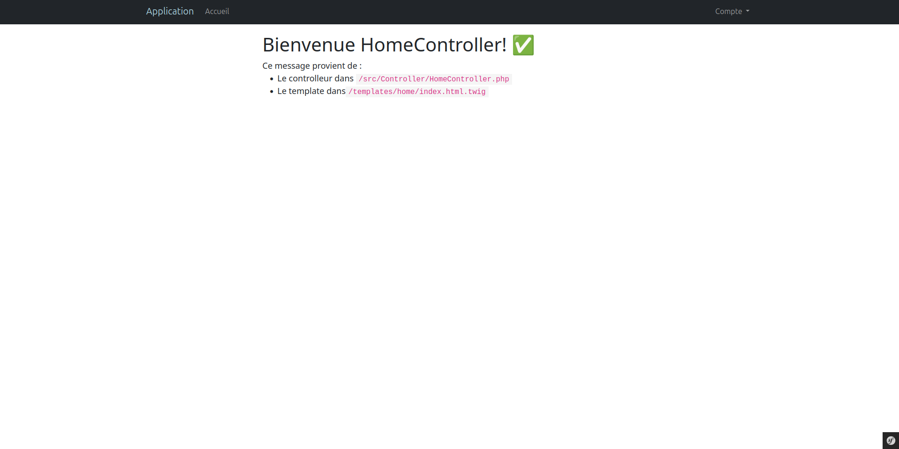

Symfony Basics
========================

Un projet qui utilise Symfony pour créer un site internet en mettant en place différents éléments proposés par le framework.

Il propose les options suivantes :
  * Connexion / Inscription / Déconnexion
  * Une Administration (gestion des rôles & des accès)
  * Des Entrypoints spécifiques à la partie visiteur & administration du site
  * Un CRUD de gestion d'articles
  * Un système de recherche d'articles utilisant les Composants Live de Symfony UX
  * Des pages d'erreurs personnalisées

Présentation générale du site
------------



Nécessaire
------------

  * PHP 8.4 ou plus
  * plus sur [besoins de symfony][1]

Installation
------------

Cloner le projet:

```bash
git clone https://github.com/aloyonnet/symfony-basics.git
```

Créer le fichier .env:

```bash
cp .env-template .env
```

Installer les dépendances:

```bash
composer install
```

Créer le lien avec la base de données dans le fichier .env:
```bash
DATABASE_URL=
```

Créer la base de données et son contenu:
```bash
//création de la base de données
php bin/console doctrine:database:create
//génération de la migration
php bin/console make:migration
//envoi de la migration dans la base
php bin/console doctrine:migrations:migrate
```

Charger les données fournies par défaut :
```bash
php bin/console doctrine:fixtures:load
```

Compiler le Sass :
```bash
php bin/console sass:build
php bin/console asset-map:compile
```

Utilisation
-----

Comptes disponibles avec les Fixtures (utilisateur/mot de passe) :

* admin/test
* user/test

Pour un environnement de développement il est possible de lancer un serveur (utilisant <http://localhost:8000> par défaut) avec :

```bash
symfony serve
```

Si le binary de symfony n'est pas installé, on peut utiliser la commande qui suit:
`php -S localhost:8000 -t public/`

Pour ne pas avoir à recompiler le Sass à chaque modification en développement :

```bash
php bin/console sass:build --watch
```

[1]: https://symfony.com/doc/current/reference/requirements.html